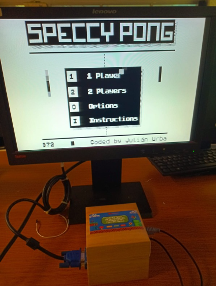

# ZX-ESPectrum-Final-MicroP
- [Spanish](./README_es.md) 

> **IMPORTANT**: This project is an adaptation of [dcrespo3d](https://github.com/dcrespo3d/ZX-ESPectrum-Wiimote) for the final project of the Microprocessors course (June 2024).

## Project Description
This project is an emulator for the Z80 processor on an ESP32 board, using a PS/2 keyboard and a VGA screen to simulate the environment of the Sinclair ZX Spectrum computer. Below are the main milestones of the development process.

## Roles and Tools Used
- **Roles**:
  - Andrea Arias: Product Manager
  - Orlando Arroyo: Hardware Developer
  - Karen Barros and Cristian Vasco: Software Developers

- **Tools**:
  - Notion for task assignment and tracking
  - Visual Studio Code, Arduino IDE
  - GitHub for version control

---

## Development Process

### Hardware Connections
1. **VGA Connector Adaptation**:
   - The VGA connector pins were soldered to the ESP32 board, ensuring continuity of the connections.
   - 
   - 

2. **PS/2 Connector**:
   - Adaptation of a female PS/2 connector using a PS/2 to USB converter.
   - 
   - 

3. **Logic Level Converter**:
   - Implemented to ensure proper communication between the ESP32 and the PS/2 keyboard.

### Hardware Testing
- **VGA Screen Testing**:
  - Verification of the logo in basic colors and code adjustments to display different colors.
  - 

- **PS/2 Keyboard Testing**:
  - Communication between the keyboard and the ESP32 was evaluated, and power compatibility issues were resolved.

---

## Software Integration
1. **Z80 Emulator**:
   - Code adjusted to emulate games and specific colors on the VGA monitor.

2. **Wii Connection**:
   - Connection with a Wii controller via Bluetooth was tested. Although successful, it was not integrated into the final version.

---

## Final Phase
- **Packaging**:
  - A box was designed to protect the circuit and improve the device's aesthetics.
  - 

- **Final Testing and Presentation**:
  - Assembly and final testing of the system under usage conditions to ensure proper operation.

---

## Results
The project achieved the established objectives, implementing a functional emulator of the ZX Spectrum on the ESP32 and successfully integrating the planned hardware and software.

> **Note**: Refer to [dcrespo3d's original README](https://github.com/dcrespo3d/ZX-ESPectrum-Wiimote) for more technical details.
